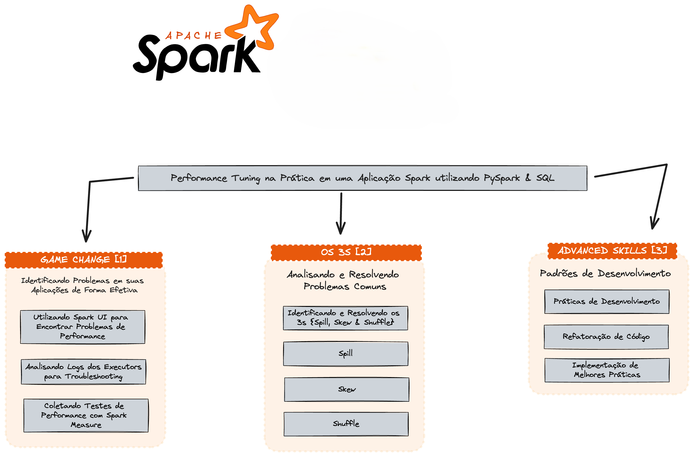

# Apache Spark & Trip Record Data Analysis [Spark Measure]
https://www.nyc.gov/site/tlc/about/tlc-trip-record-data.page



# install homebrew
```shell
/bin/bash -c "$(curl -fsSL https://raw.githubusercontent.com/Homebrew/install/HEAD/install.sh)"

(echo; echo 'eval "$(/home/linuxbrew/.linuxbrew/bin/brew shellenv)"') >> /home/romanzini/.bashrc
eval "$(/home/linuxbrew/.linuxbrew/bin/brew shellenv)"

sudo apt-get install build-essential

brew install gcc
```

# verify python
```shell
python3 --version
```

# install & create env
# project [location]
```shell
pip install virtualenv

virtualenv venv
```

# activate
```shell
source venv/bin/activate
```

# deactivate
```shell
source venv/bin/deactivate
```

# install java
```shell
sudo apt install openjdk-11-jre-headless
```

### verify local spark installation
```shell
pip install -r requirements.txt
pyspark --version

spark-submit --help
http://localhost:4040/jobs/
```

### install required packages
```shell
pip install -r requirements.txt
```

### create .env file for variables
```shell
.env

APP_SRC_PATH=/home/romanzini/projetos/tuning-spark-app/src
APP_STORAGE_PATH=/home/romanzini/projetos/tuning-spark-app/storage
APP_LOG_PATH=/home/romanzini/projetos/tuning-spark-app/logs
APP_METRICS_PATH=/home/romanzini/projetos/tuning-spark-app/metrics
APP_LOGSTASH_PATH=/home/romanzini/projetos/tuning-spark-app/events/
```

### build spark docker images [spark & history server]
```shell
docker build -t owshq-spark:3.5 -f Dockerfile.spark . 
docker build -t owshq-spark-history-server:3.5 -f Dockerfile.history .
```

### run spark cluster & history server on docker
```shell
docker-compose up -d
docker ps

docker logs spark-master
docker logs spark-worker-1
docker logs spark-worker-2
docker logs spark-history-server
```

### download files & save on [storage] folder
```shell
https://www.nyc.gov/site/tlc/about/tlc-trip-record-data.page
```

### execute spark application
```shell
docker exec -it spark-master /opt/bitnami/spark/bin/spark-submit \
  --master spark://spark-master:7077 \
  --deploy-mode client \
  /opt/bitnami/spark/jobs/elt-rides-fhvhv-py-strawberry.py
```

### access spark history server
```shell
http://localhost:8080/
http://localhost:18080/
```

### access MinIO UI
```shell
http://localhost:9001/
```

### tier down resources
```shell
docker-compose down
```
